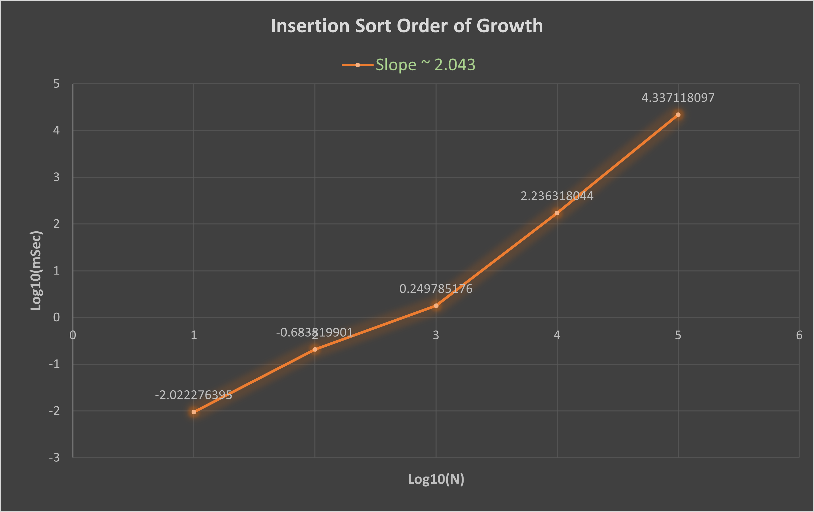
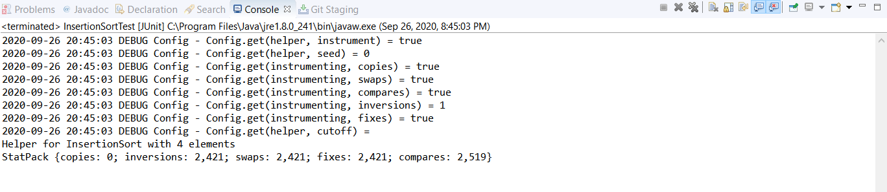
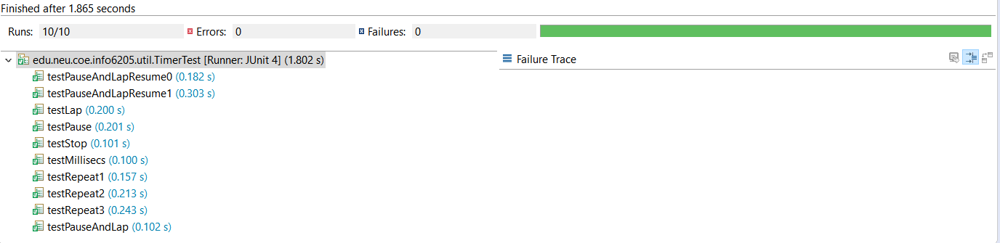
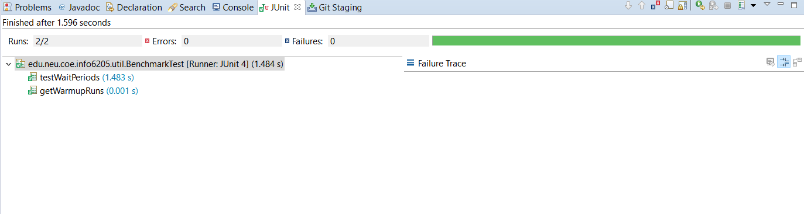
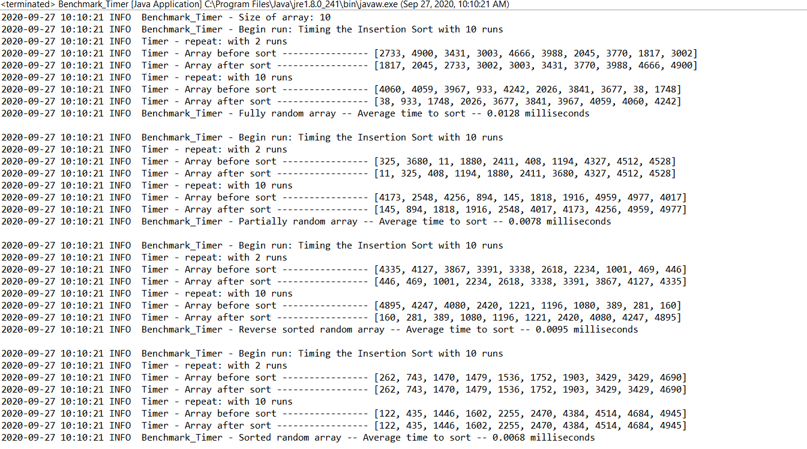
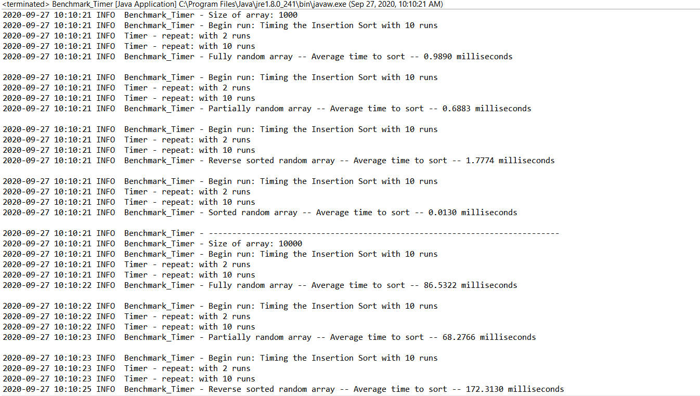
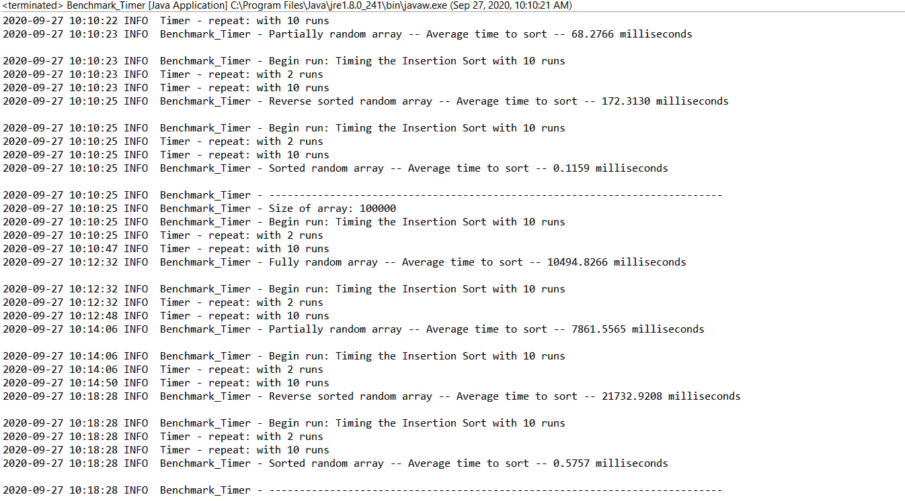

# Assignment 2 - Insertion Sort

## Implementation

    public void sort(X[] xs, int from, int to) {
        final Helper<X> helper = getHelper();
        // TO BE IMPLEMENTED
        for (int i = from; i < to; ++i) {

            int j = i;

            while (j > 0 && (helper.compare(xs[j - 1], xs[j]) == 1)) {

                helper.swap(xs, j-1, j);
                j--;
            }
        }
    }

## Observation
   ***
I've run the algorithm with 5 different problem sizes - 10, 100, 1000, 10000, 100000. Where 
each problem size is 10 times larger than the previous. 
For each problem size, I've generated 4 different types of arrays
1. Random array
2. Partially sorted array
3. Reverse sorted array
4. Sorted array
For every problem set, I've run the InsertionSort.sort() method 10 times with 2 warm 
up rounds. 
As sorting a reverse sorted array gives the worst case scenario, I've plotted these values 
on a graph where 
> **x-axis = log10(N)** and **y-axis = log(t)**  
> *N = number of elements* *t = time in milliseconds*
   ***

> The slope of this graph is approximately 2.043
> This means that the order of growth is **O(N^2)**

## Unit Tests
#### 1. InsertionSortTest

#### 2. TimerTest

#### 3. BenchmarkTest

## Outputs
#### 1. Output showing the average sorting time for array of size **10**
   
#### 2. Output showing the average sorting time for array of size **100** and **1000**
   
#### 3. Output showing the average sorting time for array of size **100000**   
   