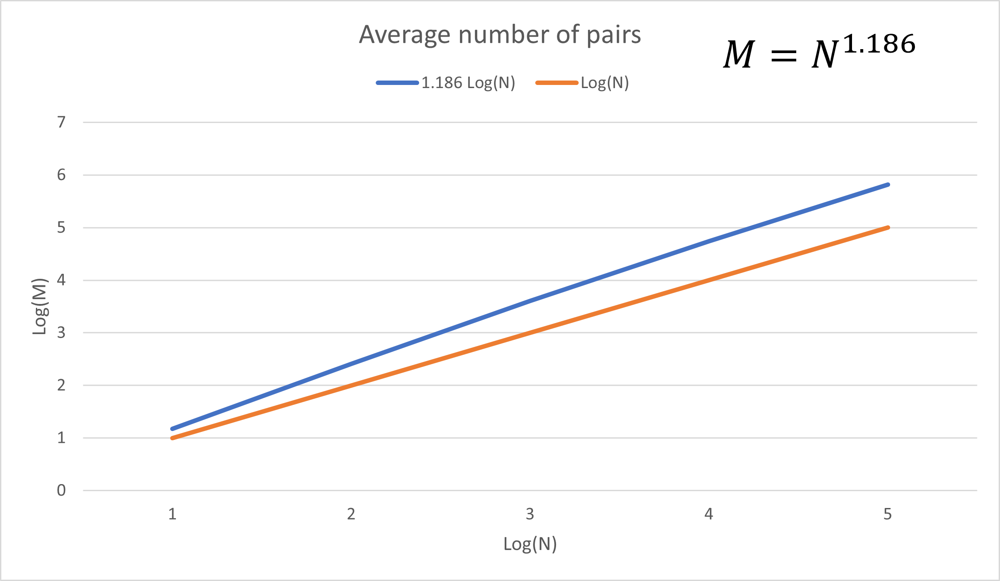
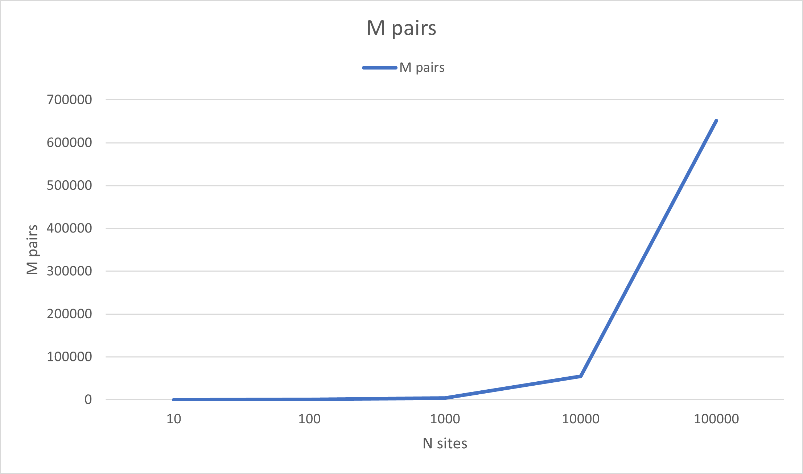
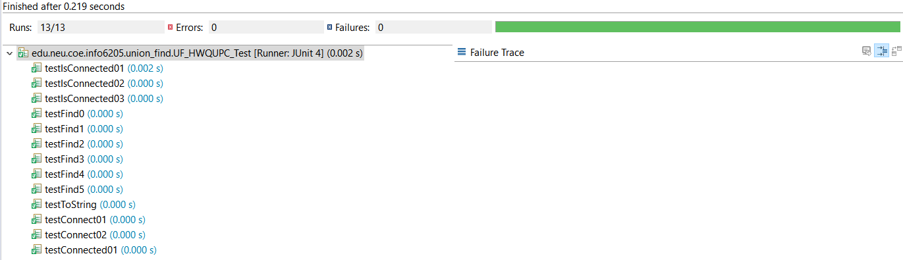
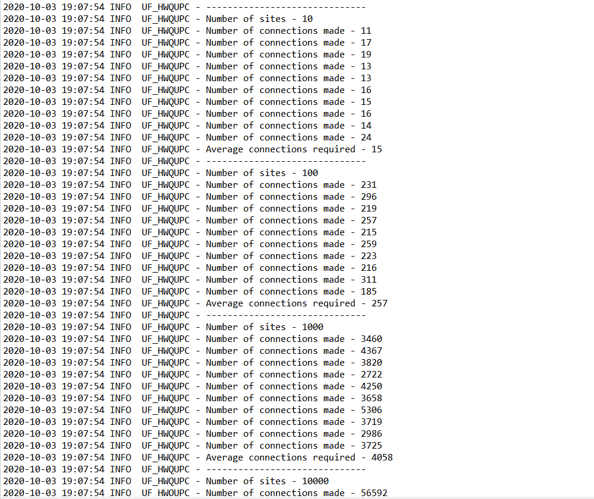
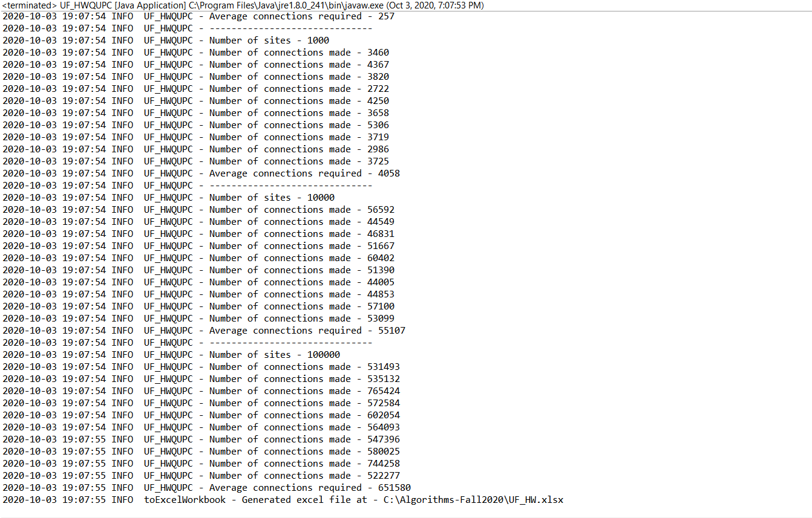

# Assignment 3 - Height-Weighted Quick Union with Path Compression

## Implementation
1. 
```java
    private void mergeComponents(int i, int j) {
        // TO BE IMPLEMENTED make shorter root point to taller one
        int root_i = i;
        int root_j = j;
        if(height[root_i] == height[root_j]) {
            updateParent(root_j, root_i);
            updateHeight(root_i, root_j);
            return;
        }
        if(height[root_i] < height[root_j]) {
            updateParent(root_i, root_j);
            updateHeight(root_j, root_i);
            return;
        }
        if(height[root_i]>height[root_j]) {
            updateParent(root_j, root_i);
            updateHeight(root_i, root_j);
            return;
        }
    }
```
2. 
```java
    public int find(int p) {
        validate(p);
        int root = p;
        
        while(root != parent[root]) {
            if(pathCompression) doPathCompression(root);
            root = parent[root];
        }
        // TO BE IMPLEMENTED
        return root;
    }
```
3.
```java
    private void doPathCompression(int i) {
        // TO BE IMPLEMENTED update parent to value of grandparent
        parent[i] = parent[parent[i]];
    }
```
## Observation
   ***
I've run the algorithm with 5 different problem sizes - 10, 100, 1000, 10000, 100000. Where 
each problem size is 10 times larger than the previous.<br>
For each problem size, I've run the algorithm 10 times

Below is the data generated from all the experiments

| Sites (N) | Average no. Pairs (M) |
| :-------- | --------------------: |
| 10        |                    15 |
| 100       |                   257 |
| 1000      |                  4058 |
| 10000     |                 55107 |
| 100000    |                651580 |

| Log(M)          |   Log(N)    | Log(M)/Log(N) |
| :-------------- | :---------: | ------------: |
| 1               | 1.176091259 |   1.176091259 |
| 2               | 2.409933123 |   1.204966562 |
| 3               | 3.608312043 |   1.202770681 |
| 4               | 4.741206769 |   1.185301692 |
| 5               | 5.813967745 |   1.162793549 |
| *Average ratio* |             |   1.186384749 |
            
The average Log(M)/Log(N) ratio is **1.186384749**
Hence, the relation between M and N is 
> 𝑀 ~ 𝑁^1.186
 
**x-axis = log10(N)** and **y-axis = log10(M)**<br> 
> *N = number of sites* *M = number of pairs generated*
   ***

**x-axis = N** and **y-axis = M**<br> 

## Unit Tests
#### 1. UF_HWQUPC Test


## Outputs
#### 1.
   
#### 2. 
   