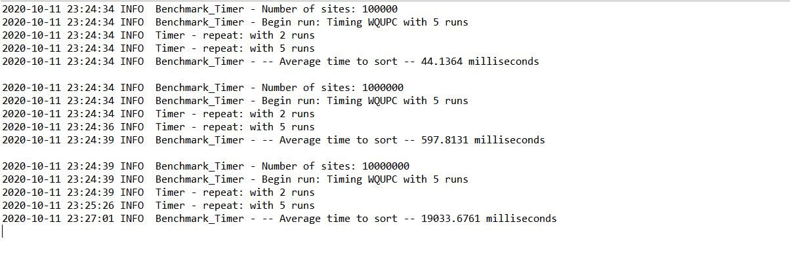
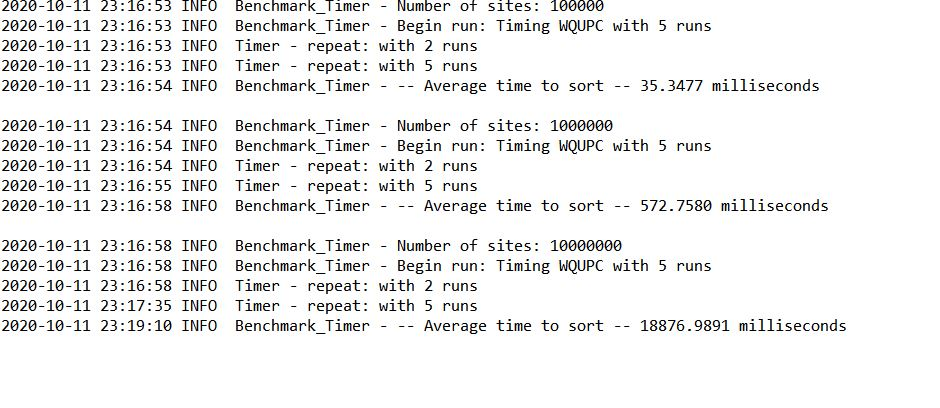
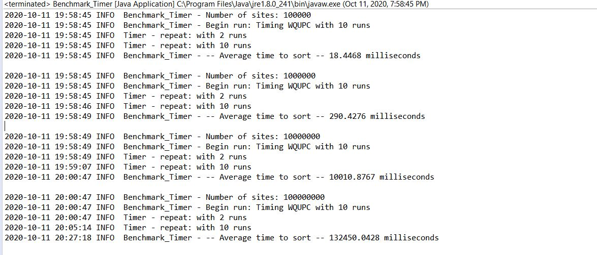
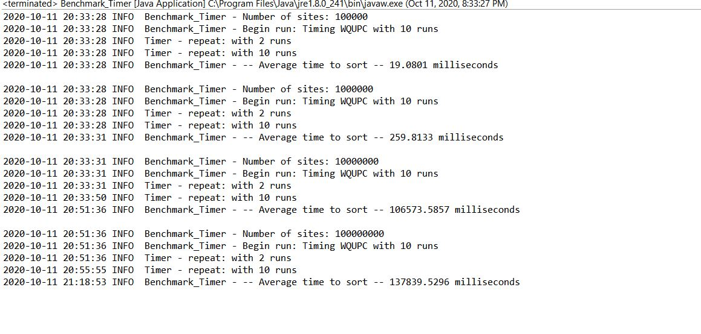

# Assignment 4 - Weighted Quick Union Find

## WQUF by Storing Depth
In my experiment, I've run the algorithm with 4 different problem sizes - 100000, 1000000, 10000000, 100000000. Where 
each problem size is 10 times larger than the previous. 

From my experiments, I've observed that the performance by storing depth and storing size is **approximately the same**

### Results from storing depth

### Results from storing Size

## WQUPC One-pass vs Two-pass Implementations
In my experiment, I've run the algorithm with 4 different problem sizes - 100000, 1000000, 10000000, 100000000. Where 
each problem size is 10 times larger than the previous. 

From my experiments, I've observed that, for small problem sets, the performance of the one-pass and two-pass implementation is comparable, but as the size of the problem set becomes larger, the one-pass implementation tends to perform considerably better than the two-pass implementation

### Peformance of One-pass Implementation

### Performance of Two-pass Implementation

