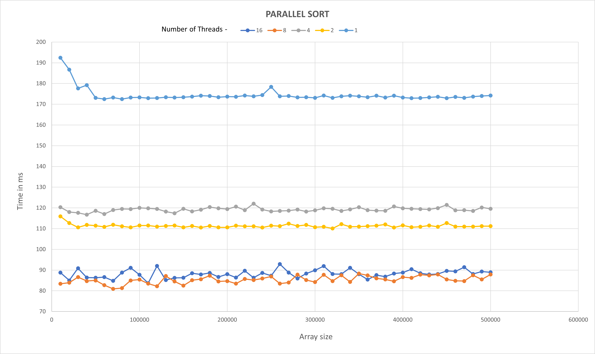

# Assignment 5 - Parallel Sort

## Parallelly sort partitions in merge sort
In my experiment, I've run the algorithm with 50 different problem sizes, starting from 1,000 to 500,000. Where 
each problem size is 1000 more than the previous. 

From my experiments, I've observed that the performance of merge sort **increases** by parallelly sorting individual partitions.

### Results from Parallel Sort

